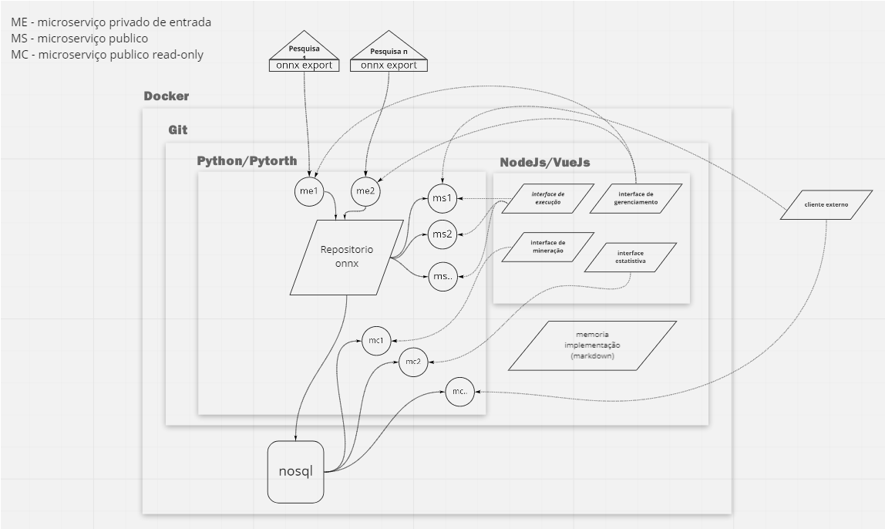

# Fenotipagem-IA-Tools

O Objetivo do projeto é unificar os modelos de deep learning usados nos projetos da embrapa fenotipagem, para permitir tanto o reuso como servir de base para novas tecnologias de deep learning.

> Memória do Conhecimento

 * [Python/pytorth/onnx/nVidea CUDA](memoria/pytorth/README.md)
 * [Nodejs/vueJs](memoria/nodejs/README.md)
 * [NoSql](memoria/nosql/README.md)
 * [Docker](memoria/docker/README.md)
